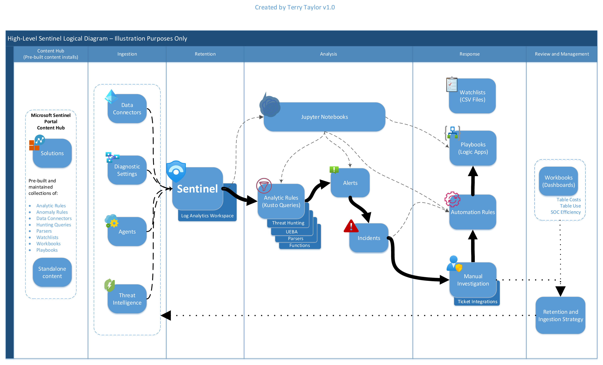
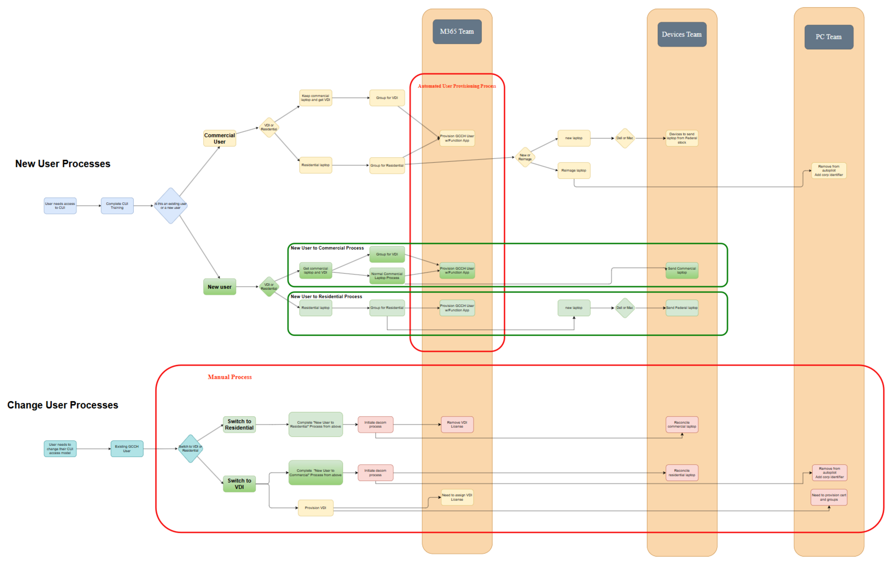
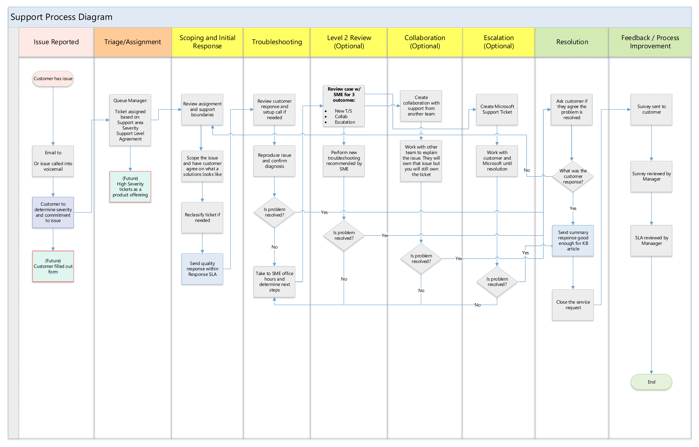

# Sample diagrams

Hand-drawn architecture and process diagrams by Terry Taylor, kept as examples
of design and documentation work.

> **Point in time, illustration only.** These are older, hand-drawn examples of
> design and diagramming approach. Each is a point-in-time snapshot, no longer
> maintained or updated, and none represents any specific, current, or
> production environment. Addresses and names are illustrative.

Drawn by hand in Microsoft Visio.

-------------------------------------------------------------------------------

## Microsoft Sentinel logical architecture

A logical view of a security operations center (SOC) built on Microsoft
Sentinel, laid out along the path a signal takes: content and connectors,
ingestion, retention, analysis, response, and a separate review and management
lane.

Ingestion is drawn separately from the retention strategy. Detection is layered,
with analytic rules over threat hunting, user and entity behavior analytics
(UEBA), parsers, and functions. Response runs through automation rules and
playbooks, with manual investigation kept in the flow. The review lane returns
to ingestion.

-------------------------------------------------------------------------------

## User provisioning process

A swimlane for onboarding and changing users across three teams in a regulated
environment that handles controlled unclassified information (CUI).

The automated provisioning path is boxed as its own region, separate from the
manual change process. The flow splits new users from existing users, and
commercial laptops from virtual desktop users. Cross-team handoffs are drawn
explicitly rather than implied.

-------------------------------------------------------------------------------

## Support process

A support lifecycle from intake through resolution and feedback, drawn left to
right.

Level two review, collaboration, and escalation are marked optional. Service
level agreement (SLA) checkpoints sit at the stages where they apply. The final
lane returns to process improvement.
